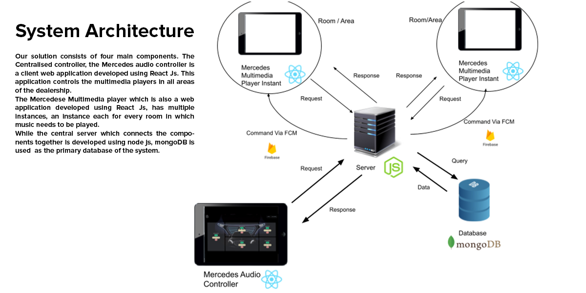
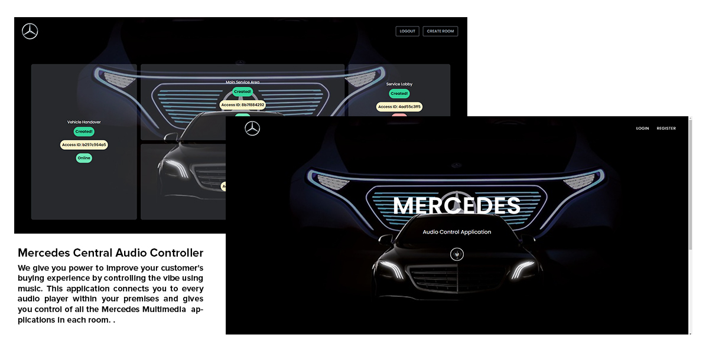
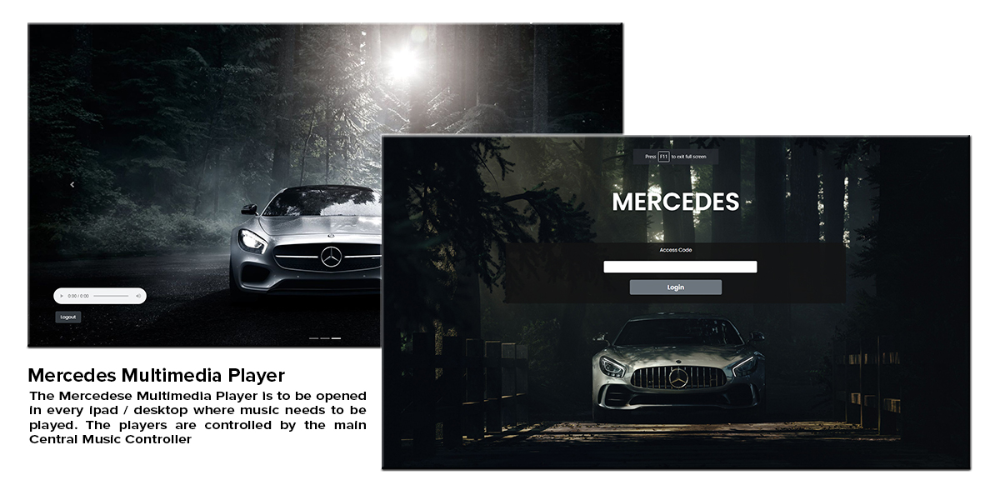

`All rights for the source code and other related material are reserved`

# Problem
Technology has made dealerships evolve into a completely digital experience for customers. The success of the car industry relies on the satisfaction the customers experience during the buying process as the foundation. This solution intends to improve the customer's buying experience in terms of sound.

# Solution
A centralized audio controller web application which can connect to the devices located in each audio zone of the premises which will  redirect the audio to the speaker installed. The application can individually change playlists, songs, and volume of the music played in each of the showroom areas in real time. Different playlists can be played to match the event, crowd or area via this application at different audio zones since the application can handle multiple devices. The solution developed has 4 primary components namely: The centralized audio controller which manages the audio zones, the multi-media player instance which redirects the audio to the speakers, the server and the database.

- Centralized audio controller - https://start-hack-main-controller.web.app/  
  
- Multi-media player instance - https://starthack-796b2.web.app/login

- Centralized audio controller repository - https://github.com/avishkajayasundara/StartHack-Client-Application
  
- Multi-media player repository - https://github.com/avishkajayasundara/Mercedes-Multimedia-Player

# Technologies Used
The backend for this solution was developed using Node JS with Mongo DB as the database, whereas the central controller and the media player applications are developed using React JS. Additionally, Firebase cloud messaging is used to communicate with media player instances and command them.

# Solution

# User interfaces

# Future Impacts 
The primary goal of this solution is to improve customer experience with an innovative solution which would attract the customer attention in a positive light to the cars by setting the mood. As a result of this application the Mercedes Benz company can profit with customers who show interest not just for the brand name  but also the energy and atmosphere of the dealership.

# Future Enhancements
As for the future enhancements of this solution we hope to analyze the mood of the crowd from the facial expressions exhibited and change the playlist to satisfy the customers in a any location in real-time by changing the atmosphere via the music played. Additionally, an enhancement which will automatically adjust the volume of the audio played via the data acquired from the sensors by monitoring the crowd density in a location too can be implemented.

# Team
Guyson - https://github.com/cmdrGuyson
Avishka - https://github.com/avishkajayasundara
Neith - https://github.com/NethmiRodrigo
Shadiya - https://github.com/ShadiyaIffath
